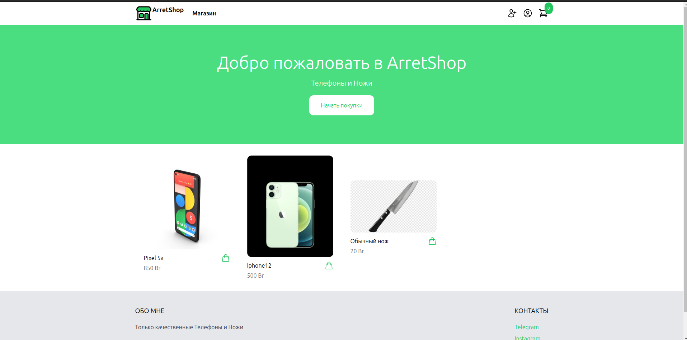
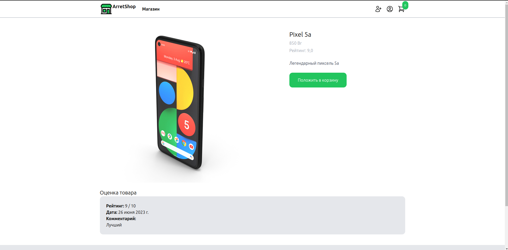
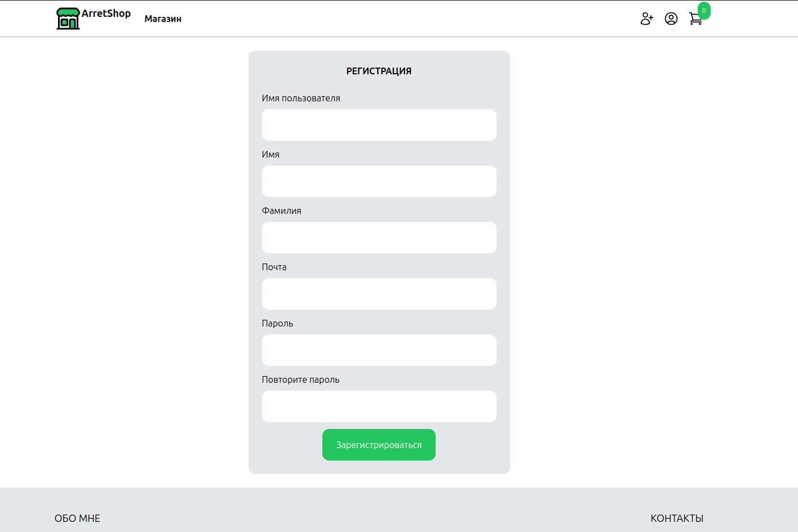
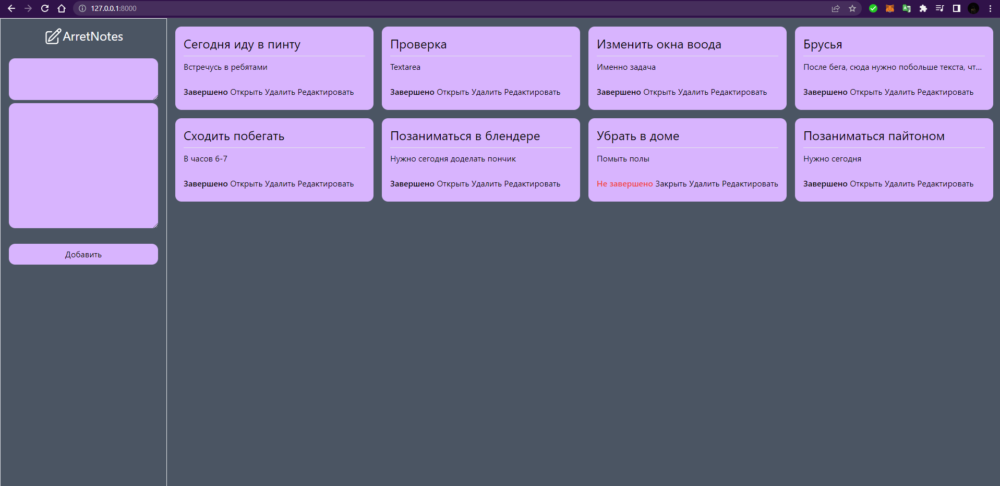
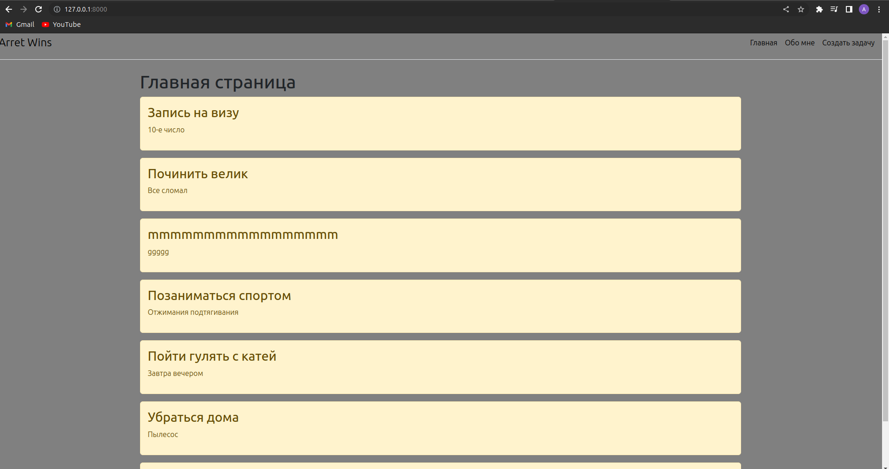

  

<h1 align="center">
  Hello!
  
</h1>

# Интернет-магазин
Welcome to my project - an online store built on Django, utilizing Tailwind, HTML, and CSS. This project represents an online store where you can purchase phones and knives. The project was created without a specific purpose, but we decided to feature these items.

-On this page, you'll find an overview of the products offered in our online store.

-Here, you can explore a specific product. You can also leave a review for the product and add it to your cart.

-This page is connected to the registration procedure for new users.

# To-do-App
For variety, alongside the online store, we've also implemented a simple "To-do App". It serves as a good example of a CRUD application.
!Feel free to experiment with the different tasks presented in this project and understand how everything works.

Thank you for your attention and interest in our project!
