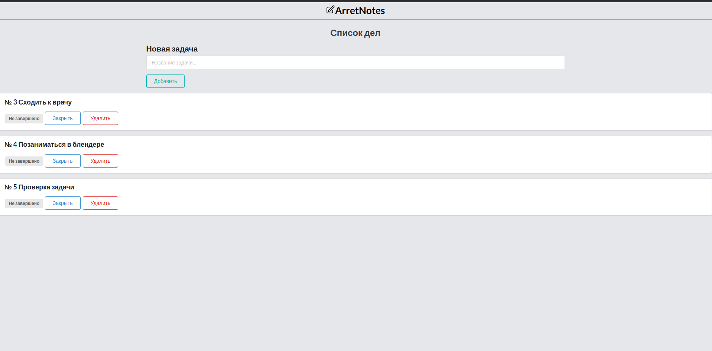

  

<h1 align="center">
  Привет!
  
</h1>

# Интернет-магазин
Этот небольшой проект на Django с использованием Tailwind, HTML/CSS - Интернет-магазин. Идей особо не было так что там продают телефона и ножи:)

-Стартовая страница:

-Страница товара. Пользователь может написать отзыв, положить товар в корзину.

-Страница регистрации.

# To-do-App
Список дел является неплохим CRUD-приложением.)
!Вот несколько различных списков дел которые были сделаны теми же технологиями.

